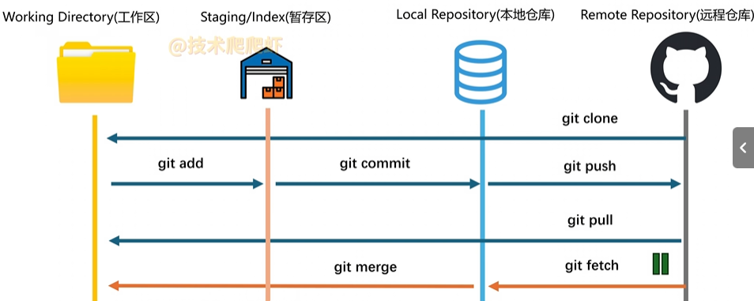
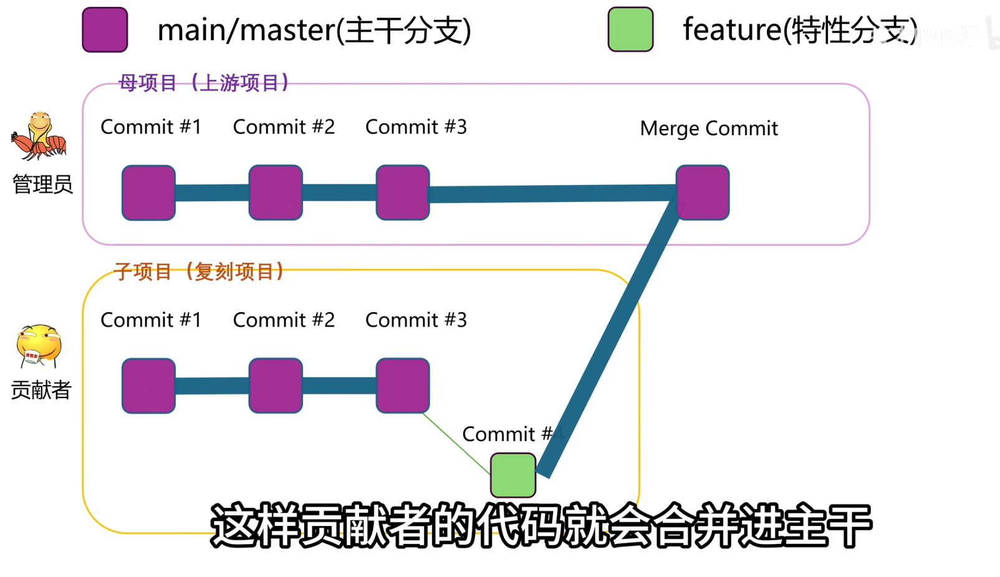
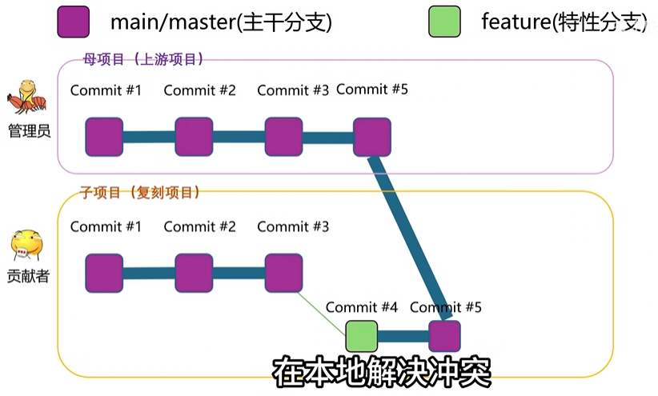
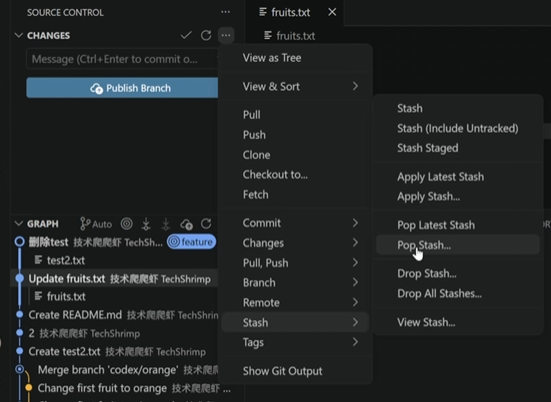
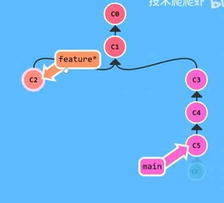
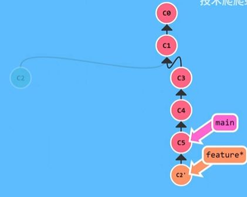

cd ~/my-project

### 1. 初始化（会生成 .git 隐藏文件夹）
git init

### 2.（可选但推荐）加个 .gitignore，避免把 node_modules、.env 这类东西传上去
##### 可以手建，也可以参考 github/gitignore 模板

### 3. 把所有文件加入暂存
git add .

### 4. 首次提交
git commit -m "Initial commit"

### 把远程仓库起个别名叫 origin（惯例叫法）
git remote add origin https://github.com/用户名/仓库名.git

### 验证一下
git remote -v

### GitHub 默认分支是 main，本地 git init 出来可能是 master，统一改名
git branch -M main

### 首次推送，-u 把 origin/main 设为上游，以后直接 git push 就行
git push -u origin main

### 第一次推完，-u已经绑好上游，平时就这三句：
git add .
git commit -m "描述这次改了啥"
git push
最好直接在vscode上进行操作
### 建立关联
git push --set-upstream origin main

### 强制回退：git reset --hard a1b2c3d（每次提交的哈希值）
也可以右键选择checkout（detached）分离头指针或create branch
### 撤回该次修改：git revert 哈希值

点击左下角可以新建/切换分支，不同的分支上的修改不会互相可见
### 合并分支：git merge 分支名 (合并后切回主分支，记得右键删除分支)

### 合并冲突：
    修改了同一行代码后，github会提醒like this：
    CONFLICT (content): Merge conflict in src/app.js
    Automatic merge failed; fix conflicts and then commit the result.
    查看具体文件：
    git status
    得到：
    Unmerged paths:
    both modified:   src/app.js
    打开src/app.js看到
    <<<<<<< HEAD
    const timeout = 5000;
    =======
    const timeout = 3000;
    >>>>>>> feature/login
    修改为正确的值后（两个改成一样的），删除标记后提交，点击下就可以把上面的定个即可

### 克隆仓库
源代码管理里面可以克隆仓库，复制仓库的网址即可
从github上面拉取改动：git pull origin main或者直接在vscode里点击sync changes

## Github
下载代码：点击code选择下载安装包或者git clone网址，把代码下到本地
issue可能可以帮助解决问题
t键：文件搜索栏
L键：定位到哪一行
git blame可以查看该行代码是谁上传的
？键可以查看快捷键
。键：打开一个网页版的vscode，帮助查看代码
左边运行与调试按钮->继续工作->Create New Codespaces申请运行环境
### 多人合作
右上角点击fork复制一份到自己的名下，修改代码先创分支
#### pull requests(合并请求)

PR之前先把原仓库的变化拉取到分支上，解决冲突

    查看当前远程仓库地址，确认是否有 upstream
    git remote -v
    如果没有 upstream，添加母项目的地址
    git remote add upstream https://github.com/
    第二步：获取母项目的最新代码
    这一步只是把母项目的新提交下载到你本地，不会影响你正在写的代码。
    git fetch upstream

    1. 切换到你的本地主干分支
    git checkout main
    2.将母项目的主干合并进来（这是安全的，因为 main 分支通常不写代码）
    git merge upstream/main
    3.将更新后的主干推送到你自己的远程仓库
    git push origin main
    4. 切换回你正在开发的功能分支
    git checkout feature-你的分支名
    5.将 main 分支的最新改动“搬”到你的 feature 分支顶端
    这相当于把你新增的 Commit #4 重新应用在最新的 Commit #5 之后
    6.git rebase main
    遇到冲突像上述那样便可解决
    删除标记后：
    git add .
    git rebase --continue
注意箭头方向<-
### 添加创作者
settings：选择collabrations，右上角的收件箱收到邀请
### cherry pick
git cherry-pick c7d8e9f..a1b2c3d(左开右闭区间：不包含​ c7d8e9f，包含​ a1b2c3d)
git cherry-pick c7d8e9f^..a1b2c3d包含起点
git cherry-pick commitA commitB commitC不连续多个提交
### Stash
更改二字对应的三角号stash和pop stash

### rebase(变基)只能强制推送，单人仓库
git rebase main(feature的c2作为main的第一个)

ERQI2026招新
https://github.com/Bonfire999/ERQI2026-.git