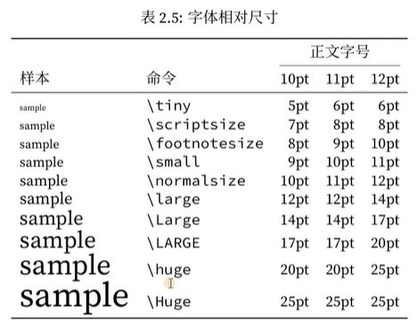
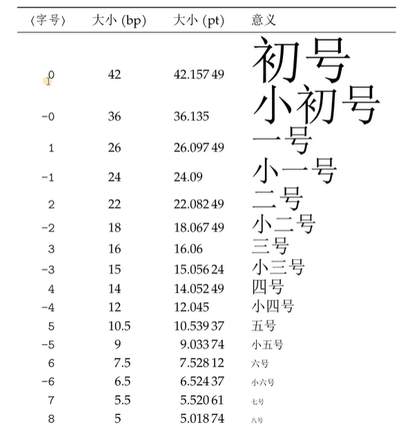
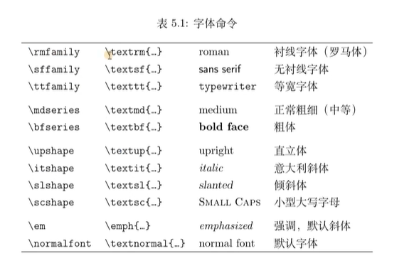

### LATEX
#### 导言区
##### 文档类
**\documentclass[⟨options⟩]{⟨class-name⟩}**
**\documentclass{article}**  %文档类（模板），会自动设置一些最基本的板式
文档类：
article 文章格式的文档类，广泛用于科技论文、报告、说明文档等。
report 长篇报告格式的文档类，具有章节结构，用于综述、长篇论文、简单
的书籍等。
book 书籍文档类，包含章节结构和前言、正文、后记等结构。
proc 基于article 文档类的一个简单的学术文档模板。
slides 幻灯格式的文档类，使用无衬线字体。
minimal 一个极其精简的文档类，只设定了纸张大小和基本字号，用作代码测
试的最小工作示例（Minimal Working Example）
支持中文排版的有ctexart、ctexrep、ctexbook

##### 宏包
**\usepackage[⟨options⟩]{⟨package-name⟩}**
在Windows 命令提示符或者Linux 终端下输入命令可查阅相应文档：
**texdoc ⟨pkg-name⟩**，其中⟨pkg-name⟩ 是宏包或者文档类的名称。

##### 文件组织形式
**\include{⟨filename⟩}**
⟨filename⟩ 为文件名（不带.tex 扩展名），如果和要编译的主文件不在一个目录中，则要加上相对或绝对路径，例如：
\include{chapters/file} % 相对路径
\include{/home/Bob/file} % *nix（包含Linux、macOS）绝对路径
\include{D:/file} % Windows 绝对路径，用正斜线
值得注意的是\include 在读入⟨filename⟩ 之前会另起一页。有的时候我们并不需要这样，而是用\input 命令，它纯粹是把文件里的内容插入：**\input{⟨filename⟩}**
当导言区内容较多时，常常将其单独放置在一个.tex 文件中，再用\input 命令插入。复
杂的图、表、代码等也会用类似的手段处理。
LATEX 还提供了一个\includeonly 命令来组织文件，用于导言区，指定只载入某些文件。
导言区使用了\includeonly 后，正文中不在其列表范围的\include 命令不会起效：
**\includeonly{⟨filename1⟩,⟨filename2⟩,…}**
在导言区使用\syntaxonly 命令，可令LATEX 编译后不生成DVI 或者PDF 文档，只排查错误，编译速度会快不少：
**\usepackage{syntonly}**
**\syntaxonly**
如果想生成文档，则用% 注释掉\syntaxonly 命令即可。

%为注释
输出百分号、井号：\%、\#
输出斜杠：\textbackslash
输出{}：\{\}

%正文区   
**\begin{document}**
**\end{document}**

支持中文：
导包：**\usepackage{ctex}**
替换文档类：**\documentclass{ctexart}**

#### 标题、作者、日期
\title{\LaTeX 从入门到放弃}
\author{HerrPeng \and XXX \and XXX\thanks{写要添加的内容}}
\date{2026-09-07}也可以什么时候编译的显示什么时候\date{\today}
**一定记住要在正文区写\maketitle**

#### 分段、换行、空格
换行：
\\ 或 \newline
分段：
中间空一行 或 \par
空格：
**\hspace{1em}**(数字＋em,空几个汉字的大小)  水平空格
**\vspace{1em}**  竖直空行

#### 居中
\begin{center}
\end{center}
左边就是\begin{flushleft}；右边{flushright}
#### 取消缩进
无缩进位置处 **\noindent** 或 导言区(整篇无缩进) **\parindent = 0pt** 或 **\setlength{\parindent}{0pt}**
#### 设置行距
latex
1倍行距=1基础行距
1.5倍行距 = 1.5 * 基础行距
基础行距=1.2*字号
word
基础行距=1.3 字号
world * 1.3 = latex * 1.2

导言区（全篇）**\linespread{2}**  或
修改大括号内部分 **{linespread{2}\selectfont.....}**+**\par**分段  或
引入宏包：
**\usepackage{setspace}**
**\doublespacing**：两倍行距
**\setstretch{1.3}**全篇
**\begin{spacing}{2}**
**\end{spacing}**部分

#### 字号与字体
字号：
导言区：**\documentclass[10pt]{ctexart}**  只能填10,11,12

从哪里加，以后的字体都会变换
**{\Huge}**可以只改部分
**\begin{Huge}**
**\end{Huge}**也可以

以下的都可以通过大括号进行部分修改
**\fontsize{字号}{行距}\selectfont**
**\zihao{填下面表格里的字号}**

字体：cmd里输入 fc-list -f "%{family}\n" (:lang=zh)可以查看英文（中文）字体
**\heiti、songti、yahei 、fangsong 、kaishu 、lishu 、youyuan**
加粗：\bfseries
斜体：\itshape
英文字体：\rmfamily（衬线）、\sffamily（无衬线）、\ttfamily(等宽)

xelatex 和lualatex 命令下支持用户调用字体的宏包是fontspec。宏包提供了几个设置全局字体的命令，设置\rmfamily 等对应命令的默认字体2：
\setmainfont{⟨font name⟩}[⟨font features⟩]
\setsansfont{⟨font name⟩}[⟨font features⟩]
\setmonofont{⟨font name⟩}[⟨font features⟩]

例如：
英文：
\usepackage{fontspec}
\setainfont{Consolas}
改部分：\fontspec{Consolas}
简便方法：
\newfontfamily{\cls}{Consolas}
\cls（就可以代替）
中文：
\setCJKmainfont{字体}
部分：\CJKfontspec{字体}
依旧简便方法：
\newCJKfontfamily{\xk}{华文行楷}
\xk

#### 下划线与颜色
调包：\usepackage[normalem]{ulem}
\uline{内容}
\uuline{}两条下划线
\uwave{}波浪线
\dotuline点线
\xout
\sout划掉
或者：
\usepackage{CJKfntef}
\CJKunderline、CJKunderdblline、CJKunderwave、CJKunderdot

颜色：
\usepackage{xcolor}
整段
\color{颜色名}
\color[rgb]{r,g,b}
部分：
\textcolor{颜色}{内容}
\textcolor[rgb]{r,g,b}{内容}
背景色：只能放一行，内容不能过长
\colorbox{颜色}{内容}
\colorbox[rgb]{r,g,b}{内容}
边框加背景
\fcolorbox{边框色}{背景色}{内容}
\fcolorbox[rgb]{边框rgb}{背景rgb}{内容}

#### 纸张与页边距
\usepackage[landscape]{geometry},可以将纸张调为横版
导包：\usepackage{geometry}
\geometry{a4paper,left=2cm,right=2cm,top=1cm,bottom=2cm}  或 a3paper、b5paper
简写:\geometry{a4paper,hmargin=2cm,vmargin=1cm}水平和竖直
\geometry{a4paper,hmargin=2cm}水平和竖直一样

#### 分页与分栏
分页：\newpage(分栏后的部分在右边分栏) 、 \clearpage（剩余部分直接新起一页）

分栏：导包的时候：\documentclass[12pt,twocolumn]{article}
也可以单独使用，在要分栏的地方输入\twocolumn即可
恢复使用\onecolumn 

#### 摘要、摘录、脚注、边注
摘要：
\begin{abstract}
内容
\noindent{\textbf{关键字：}LaTeX;学习;练习}
\end{abstract}

摘录：
\begin{quote}短句
加脚注：\footnote{唐·张若虚《春江花月夜》}
加边注：\marginpar{\tiny 唐·张若虚《春江花月夜》} 或 \marginpar{\footnotesize 唐·张若虚《春江花月夜》}
重新设为0：\setcounter{footnote}{0}
\end{quote}

\begin{quotation}
\end{quotation}第一行会多空两个字：段落

\begin{verse}
\end{verse}第一行顶格，剩下的空两个：诗歌

\begin{verbatim}代码
\end{verbatim}

#### Box
setlength{\fboxrule}{2pt}边框粗细
setlength{\fboxsep}{5pt}边框与字的距离
\fbox{内容}

对齐：l:left r:right c:center s:两端对齐（字会分散）
\framebox[宽度][对齐]{内容}

外对齐：需要有前后文：t:top m:middle b:bottom
\begin{minipage}[外对齐][高度][内对齐]{宽高}

升降：-下移；+上移    填空题可以用\rule[-2pt]{4em}{1pt}
\rule[升降]{宽度}{高度}

\usepackage{graphicx}   c：绕中心  l：绕左端  r：绕右端
\rotatebox[origin=c]{角度}{内容}  可以旋转文字（逆时针）

重叠字：\rlap{内容} 和 \llap{内容}
\rlap{\rule[升降]{宽度}{高度}} llap

#### 自定义命令
\newcommand{命令名称，如\dq}{命令内容，如\kaishu \\ 内容 \\}
\dq即可

\newcommand{\bi}[2]{\textbf{#1} \textit{#2}}最多只能传九个参数
\bi{Hello}{world}   若调换#1与#2会打印world Hello

\renewcommand{\kaishu}{}

#### 插入图片
\usepackage{graphicx}
如果加上\usepackage[draft]{graphicx}变成草稿模式，缩短编译时间
\includegraphics[width=10em 或 width=这里可以加倍数\linewidth 或 scale=0.4,angle=45]{图片路径，斜杠要写成/}

#### 浮动体与图片排版
有点像紧密环绕
h:here  原文字位置
t:top  页面顶部
b:bottom 页面底部
!可以忽略一些限制
p:page 放在下一页
htbp!:让系统自己决定

\begin{figure}[htbp!]
    \centering
    \includegraphics [width=\linewidth]
    {img/test_img_1.jpg}
    \caption{标题}
    \label{fig:enter-label}
\end{figure}

两栏的话，figure*可以跨栏排版，只不过只有tb两种可选

三张图片共用一个标题排版：
\begin{figure}
    \centering
    \includegraphics [width=0.4\linewidth]
    {img/test_img_2.jpg} **\hfill**
    \includegraphics [width=0.4\linewidth]
    {img/test_img_3.jpg} \\
    **\vspace{lem}**
    \includegraphics [width=\linewidth]
    {img/test_img_1.jpg}
    \caption{caption}
    \label{fig:enter-label}
\end{figure}

两张图片排版：借助minipage盒子
\begin{figure}
    \centering
    \begin{minipage}{0.4\linewidth}
        \includegraphics[width=\linewidth]
        {img/test_img_2.jpg}
        \caption{并排标题1}
    \end{minipage}
    \hfi11
    \begin{minipage}{0.4\linewidth}
        \includegraphics[width=\linewidth]
        {img/test_img_3.jpg}
        \caption{并排标题2}
    \end{minipage}
\end{figure}

三张图片三个分开的标题：
调用宏包:\usepackage{subcaption}
\begin{figure}
    \centering
    \begin{subfigure}{0.4\linewidth}
        \includegraphics[width=\linewidth]
        {img/test_img_2.jpg}
        \caption{子标题1}
    \end{subfigure} \hspace{2em}
    \begin{subfigure}{0.4\linewidth}
        \includegraphics[width=\linewidth]
        {img/test_img_3.jpg}
        \caption{子标题2}
    \end{subfigure} \\ \vspace{lem}
    \begin{subfigure}{\linewidth}
        \includegraphics[width=\linewidth]
        {img/test_img_1.jpg}
        \caption{子标题3}
    \end{subfigure}\caption{大标题}
    \label{fig:fig4}保证每一个label都是唯一的如同身份证
\end{figure}

以后就可以使用：根据图\ref{fig:fig4}可以得到
\pageref{fig:fig4}可以获取图片所在页数
                        
                     去框
引入宏包：\usepackage[hidelinks]{hyperref}后
重命名，把figure换成图片：\renewcommand{\figureautorefname}{图}
可以使用\autoref{fig:fig4}

#### 有序列表和无序列表